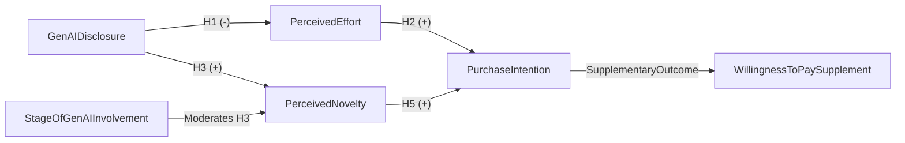

# Not All GenAI Disclosures Are Alike

## How the Stage of GenAI Involvement Shapes Purchase Intention for Digital Games

**ICEB 2026 · Beijing, China**

---
layout: agenda
---

# Roadmap

1. Research context and motivation
2. Theoretical framework and hypotheses
3. Scenario-based experiment
4. Empirical findings
5. Contributions and implications

---
layout: section
---

# Research Context

---
layout: default
---

# Why GenAI Disclosure in Games Matters

<h3>Evidence from AI product research</h3>

<ul>
<li>Disclosure of AI involvement can reduce valuation in creative contexts.</li>
<li>Users may infer weaker human authorship, effort, and authenticity.</li>
</ul>

<h3>What is unique in digital games</h3>

<ul>
<li>Games are interactive hedonic systems whose value unfolds during use.</li>
<li>Disclosure can signal not only production origin, but also experiential potential.</li>
</ul>

In games, GenAI disclosure can activate both source-based inferences and interaction-based expectations.

---
layout: default
---

# Stage of GenAI Involvement as a Critical Distinction

The same "GenAI disclosure" can be interpreted differently depending on when AI is framed as contributing.

<h3>Pre-interaction involvement</h3>

GenAI is described as helping generate dialogue, events, and world content before gameplay starts. AI is framed as a backstage production aid.

<h3>During-interaction involvement</h3>

GenAI is described as generating dialogue, events, and interactions in real time during gameplay. AI is framed as an in-play interaction capability.

This stage distinction is expected to shape novelty inferences and downstream purchase-related responses.

---
layout: statement
---

# Research Question

**How does GenAI disclosure influence players' purchase intention for digital games, and through what mechanisms does this effect emerge?**

---
layout: section
---

# Theoretical Framework

---
layout: default
---

# Dual-Pathway Logic

<strong>Negative pathway</strong> GenAI disclosure lowers <em>perceived effort</em> by weakening inferences of human creative labor.

<strong>Positive pathway</strong> GenAI disclosure can increase <em>perceived novelty</em> by signaling technological distinctiveness.

<strong>Moderation</strong> The novelty pathway is stronger when GenAI is framed as contributing during gameplay.

<strong>Outcome</strong> Both pathways ultimately shape purchase intention, with willingness to pay as a supplementary outcome.

---
layout: default
---

# Hypotheses

<strong>H1</strong> GenAI disclosure decreases perceived effort.

<strong>H2</strong> Perceived effort positively influences purchase intention.

<strong>H3</strong> GenAI disclosure increases perceived novelty.

<strong>H4</strong> Stage of involvement moderates H3: stronger under during-interaction involvement.

<strong>H5</strong> Perceived novelty positively influences purchase intention.

<strong>Supplement</strong> Willingness to pay should show directionally similar but weaker patterns.

The framework predicts opposite indirect effects: a negative route via effort and a stage-contingent positive route via novelty.

---
layout: section
---

# Method

---
layout: default
class: procedure-slide
---

# Research Design and Procedure

<strong>1. Design</strong> Scenario-based online experiment in digital game context.

<strong>2. Conditions</strong> No disclosure vs. pre-interaction disclosure vs. during-interaction disclosure.

<strong>3. Stimulus</strong> Same product page (title, genre, price, screenshots, description); only disclosure statement varied.

<strong>4. Platform</strong> Participants recruited from Credamo; only respondents with prior game experience included.

<strong>5. Measures</strong> Perceived effort, perceived novelty, purchase intention, willingness to pay, checks and controls.

<strong>6. Analysis</strong> Mean comparisons, regression with controls, and bootstrap mediation (5,000 resamples).

<strong>3</strong> conditions
<strong>399</strong> valid responses
<strong>133</strong> per condition
<strong>5,000</strong> bootstrap resamples

The experiment isolates disclosure framing while keeping product information constant.

---
layout: default
---

# Experimental Stimuli: What Participants Saw

<h3>Pre-interaction disclosure text</h3>

GenAI is used to pre-generate parts of dialogue, story events, and world content during development; AI does not keep generating this content during gameplay.

<h3>During-interaction disclosure text</h3>

GenAI is used to generate parts of dialogue, in-game events, and world content in real time during gameplay.

The manipulation changes the disclosed stage of contribution, not the timing of disclosure presentation.

---
layout: default
---

# Sample and Measurement Quality

<h3>Sample profile</h3>

60.2% female; 72.7% aged 18-35; 85.5% bachelor degree or above.

<h3>Scale reliability</h3>

Cronbach's alpha: effort = .941, novelty = .816, purchase intention = .929.

<h3>Control variables</h3>

Openness to new technology, game genre preference, and AI familiarity were included in regressions.

---
layout: section
---

# Findings

---
layout: default
class: framework-slide
---

# Conceptual Model

Dual-pathway model: source-related effort loss versus stage-contingent novelty gain.

---
layout: default
---

# Manipulation Checks

<h3>Disclosure salience</h3>

Participants in disclosure conditions reported significantly higher perceived AI use than no-disclosure participants: F(2, 396) = 339.58, p &lt; .001.

<h3>Stage differentiation</h3>

Participants correctly distinguished pre-interaction versus during-interaction involvement, confirming successful stage manipulation.

Respondents noticed both whether GenAI was disclosed and which stage of involvement was described.

---
layout: default
---

# Negative Pathway: Perceived Effort

Disclosure consistently reduced effort inferences, which are positively linked to purchase intention.

<h3>H1 supported</h3>

Disclosure lowered perceived effort versus no disclosure (Welch's t = -6.18, p &lt; .001, d = -0.60; regression beta = -0.814, p &lt; .001).

<h3>H2 supported</h3>

Perceived effort positively predicted purchase intention (r = .216, p &lt; .001; regression beta = 0.081, p = .031).

<h3>Indirect effect nuance</h3>

Negative indirect effect via effort was marginal (indirect = -0.065, 95% CI [-0.146, 0.001], p = .053).

---
layout: default
---

# Positive Pathway: Perceived Novelty

The novelty route was robust, and strongly tied to purchase intention.

<h3>H3 supported</h3>

Disclosure increased novelty versus no disclosure (Welch's t = 2.88, p = .004, d = 0.32; regression beta = 0.288, p = .001).

<h3>H5 supported</h3>

Perceived novelty strongly predicted purchase intention (r = .554, p &lt; .001; regression beta = 0.409, p &lt; .001).

<h3>Mechanism strength</h3>

Compared with effort, the novelty pathway showed a stronger and more stable link to purchase intention.

---
layout: default
class: escapism-slide
---

# Moderation by Stage of Involvement

Stage framing determines whether the positive novelty mechanism is activated strongly enough.

<h3>H4 supported</h3>

Novelty was higher in during-interaction than pre-interaction disclosure (Welch's t = 2.68, p = .008, d = 0.33).

<h3>Condition-level detail</h3>

Relative to no disclosure, during-interaction framing significantly raised novelty; pre-interaction framing did not.

<h3>Mediated effect (pre)</h3>

Indirect effect through novelty was positive but not significant: 95% CI [-0.016, 0.189].

<h3>Mediated effect (during)</h3>

Indirect effect through novelty was significant: 95% CI [0.071, 0.303]; index of moderated mediation = 0.100, 95% CI [0.017, 0.197].

---
layout: default
class: loop-slide
---

# Supplementary Outcome: Willingness to Pay

WTP patterns are directionally similar but weaker than purchase intention.

1<strong>No direct differences</strong>
No significant condition-level differences in WTP were observed.

2<strong>Price anchoring</strong>
WTP was highly skewed, with median CNY 68 in all three conditions.

3<strong>Effort mechanism</strong>
Negative indirect effect via perceived effort was significant: 95% CI [-13.38, -2.01].

4<strong>Novelty mechanism</strong>
Positive indirect effect via perceived novelty was not significant: 95% CI [-1.08, 5.15].

---
layout: section
---

# Contributions and Implications

---
layout: default
---

# Theoretical Contributions

<h3>Disclosure is not unitary</h3>

The study separates disclosure presence from the stage of GenAI involvement described by disclosure.

<h3>Dual-pathway mechanism</h3>

GenAI disclosure simultaneously activates a negative effort pathway and a positive novelty pathway.

<h3>Game-context extension</h3>

Findings extend GenAI disclosure theory to interactive hedonic systems, not only static digital products.

---
layout: default
---

# Practical Implications

<strong>Design wording strategically</strong> Disclosure phrasing should be treated as a design lever, not only a compliance requirement.

<strong>Highlight in-play value</strong> Framing GenAI as contributing during gameplay can better activate novelty perceptions.

<strong>Avoid pure backstage framing</strong> Pre-interaction-only narratives may overemphasize reduced human effort and weaken evaluation.

<strong>Balance trust and excitement</strong> Platform and developer communication should jointly manage effort concerns and novelty appeal.

---
layout: default
---

# Limitations and Future Research

<h3>Limitations</h3>
<ul>
<li>Single game genre and single scenario limit generalizability.</li>
<li>Main outcomes focus on self-reported purchase intention.</li>
<li>Only stage framing is modeled; other beliefs (e.g., authenticity, realism) were not tested.</li>
</ul>

<h3>Future directions</h3>
<ul>
<li>Compare platforms, genres, and cultural contexts.</li>
<li>Incorporate interviews, behavioral logs, and field experiments.</li>
<li>Test additional moderators, including AI attitudes and innovation orientation.</li>
</ul>

---
layout: statement
---

# Takeaway

**GenAI disclosure in digital games triggers two opposite mechanisms: it can reduce perceived human effort while increasing perceived novelty, and the positive route is strongest when AI is framed as participating during gameplay.**

---
layout: acknowledgments
---

This work was supported by the National Natural Science Foundation of China [grant number 72261160394].

<strong>Thank you.</strong>

Questions and comments are welcome.

---
layout: references
---

[[bibliography]]
