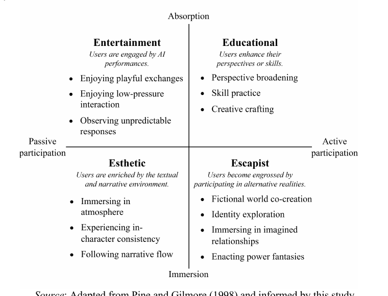

# Unpacking the Experience Economy of Role-Playing Conversational AI

## A Grounded Theory Analysis

Ke Xu · Fangzhan Lin · Zhongyun Zhou  
School of Economics and Management, Tongji University

**ICEB 2026 · Beijing, China**

---
layout: agenda
---

# Roadmap

1. Research context and motivation
2. Theoretical lens: the 4Es framework
3. Data and LLM-assisted grounded theory
4. Findings: four experiential realms
5. Contributions, implications, and future work

---
layout: section
---

# Why Role-Playing Conversational AI?

---
layout: default
---

# From Tool Use to Experiential Consumption

<h3>Dominant views in prior AI research</h3>

<ul>
<li><strong>Utilitarian systems</strong> Efficiency, usefulness, response quality, and task completion.</li>

<li><strong>Relational companions</strong> Emotional support, self-disclosure, companionship, and loneliness reduction.</li>
</ul>

<h3>What role-playing AI adds</h3>

<ul>
<li>Interaction is organized around <strong>AI personas</strong>, fictional scenes, and user-defined storylines.</li>
<li>Users actively develop characters, relationships, and narrative worlds.</li>
<li>Value emerges through <strong>experience</strong>, not only performance or support.</li>
</ul>

Role-playing conversational AI is better understood as an interactive experiential medium.

---
layout: statement
---

# Research Question

**What experiential dimensions of role-playing conversational AI can be identified through the experience economy framework?**

---
layout: section
---

# Theoretical Lens

---
layout: default
---

# Experience Economy as an Analytical Lens

## The 4Es framework

Pine and Gilmore conceptualize experiences along two continua:

- **Participation**: passive → active
- **Connection**: absorption → immersion

These continua generate four experiential realms: **entertainment**, **education**, **esthetics**, and **escapism**. @pine1998

<strong>Entertainment</strong> How are users engaged by AI performances?

<strong>Education</strong> How do users develop perspectives or skills?

<strong>Esthetics</strong> How does the textual environment enrich experience?

<strong>Escapism</strong> How do users participate in alternative realities?

---
layout: section
---

# Method

---
layout: default
---

# Data and Analytical Procedure

<strong>1. Data source</strong> Reddit community <em>r/CharacterAI</em>

<strong>2. Initial corpus</strong> All available comments up to the end of 2024

<strong>3. Length screening</strong> Comments shorter than 50 words excluded

<strong>4. Relevance filtering</strong> LLM-assisted screening for experiential role-playing content

<strong>5. Open coding</strong> Experience-related segments coded inductively in gerund form

<strong>6. Axial integration</strong> 16 subcategories integrated into 11 higher-order categories and interpreted through 4Es

<strong>6,171</strong> final comments
<strong>8,956</strong> coded instances
<strong>123</strong> initial labels
<strong>16</strong> subcategories

The pipeline combines large-scale screening with grounded, iterative interpretation.

---
layout: default
---

# Methodological Rigor

<h3>Inductive first</h3>

Comments were not directly forced into the 4Es. Experiential concepts were first derived from user discourse.

<h3>Human–AI collaboration</h3>

LLM-supported coding was combined with researcher-led refinement, constant comparison, and category development.

<h3>Validation</h3>

A random sample of 400 comments was manually assessed. Consistency, precision, and recall each exceeded 90%.

The study uses LLMs to scale interpretive coding while preserving grounded theory logic. @zhou2024

---
layout: section
---

# Findings

---
layout: default
class: framework-slide
---

# 4E Framework for Role-Playing AI

Figure adapted from the paper: entertainment and education lie on the absorption side, whereas esthetic and escapist experiences lie on the immersion side.

---
layout: default
---

# Entertainment: Engaged by AI Performances

Users stay engaged when role-play feels playful, safe, and surprising.

<h3>Enjoying playful exchanges</h3>

Users value witty, humorous, dramatic, and emotionally rewarding exchanges with AI characters.

<h3>Enjoying low-pressure interaction</h3>

The AI context offers a socially safe space with lower embarrassment, risk, and interpersonal burden.

<h3>Observing unpredictable responses</h3>

Surprise and novelty sustain curiosity by making each turn feel uncertain and interesting.

Entertainment is produced through a combination of playfulness, ease, and surprise.

---
layout: default
---

# Educational: Enhancing Perspectives or Skills

Learning value appears through reflection, practice, and co-creation.

<h3>Perspective broadening</h3>

Role-play exposes users to alternative viewpoints, emotional positions, and hypothetical situations.

<h3>Skill practice</h3>

Users rehearse expression, dialogue, and social interaction in a low-stakes environment.

<h3>Creative crafting</h3>

AI characters support collaborative building of plots, scenes, settings, and storylines.

Educational value appears as reflective and creative development rather than formal instruction.

---
layout: default
---

# Esthetic: Enriched by Textual and Narrative Environment

Aesthetic quality comes from atmosphere, consistency, and narrative continuity.

<h3>Immersing in atmosphere</h3>

Users appreciate mood and affective tone across romantic, dramatic, comforting, or fantastical scenes.

<h3>Experiencing in-character consistency</h3>

The character is valued when it stays faithful to its persona, style, and behavioral logic.

<h3>Following narrative flow</h3>

Users value coherent story development over abrupt inconsistency and fragmentation.

In role-playing AI, esthetics are textual and narrative rather than physical or spatial.

---
layout: default
---

# Escapist: Participating in Alternative Realities

Escapism peaks when users co-build worlds, selves, and relationships.

<h3>Fictional world co-creation</h3>

Users actively build and inhabit imagined scenarios with AI characters.

<h3>Identity exploration</h3>

Role-play enables experimentation with alternative selves, roles, and ways of acting.

<h3>Imagined relationships</h3>

Users engage in emotionally meaningful friendship, romance, mentorship, conflict, and related scenarios.

<h3>Power fantasies</h3>

Users enact idealized agency, competence, protection, rescue, dominance, or intensified self-positioning.

Escapist experience is especially salient because it combines fictional worlds, alternative identities, and imagined relationships.

---
layout: default
class: loop-slide
---

# How the Four Realms Work Together

The four realms form a reinforcement loop rather than independent outcomes.

1<strong>Entertainment</strong>
draws users in through playfulness, ease, and novelty

2<strong>Esthetics</strong>
stabilizes engagement through atmosphere, character consistency, and narrative flow

3<strong>Escapism</strong>
deepens participation in worlds, identities, relationships, and fantasies

4<strong>Education</strong>
emerges through reflection, practice, and creative development

Role-playing conversational AI is a form of co-created experiential consumption.

---
layout: section
---

# Contributions and Implications

---
layout: default
---

# Theoretical Contributions

<h3>Conversational AI</h3>

Conceptualizes role-playing conversational AI as experience-centered human–AI interaction, beyond utilitarian systems or companionship technologies.

<h3>Experience economy</h3>

Extends the 4Es framework to generative, interactive, and narrative AI, showing how each realm is reconfigured in this context.

<h3>Methodology</h3>

Demonstrates an LLM-assisted grounded theory procedure for large-scale naturalistic user discourse.

---
layout: default
---

# Practical Implications

<strong>Design for coherence</strong> Support atmosphere, in-character consistency, and narrative flow.

<strong>Design for playful engagement</strong> Enable enjoyable, low-pressure, and moderately unpredictable exchanges.

<strong>Design for immersive participation</strong> Support fictional co-creation while guarding against emotional overinvestment and blurred boundaries.

<strong>Design for reflective affordances</strong> Treat perspective broadening, skill practice, and creative crafting as part of experiential value.

---
layout: default
---

# Limitations and Future Research

The study is exploratory; broader datasets and methods are needed next.

<h3>Limitations</h3>
<ul>
<li>Data are drawn exclusively from <em>r/CharacterAI</em>.</li>
<li>Evidence is based on user-generated comments rather than direct interaction traces.</li>
<li>LLM-assisted coding may still involve prompt sensitivity and model-specific bias.</li>
<li>The study is qualitative and exploratory.</li>
</ul>

<h3>Future research</h3>
<ul>
<li>Compare platforms, communities, and cultural contexts.</li>
<li>Combine discourse analysis with interviews, usage logs, or experiments.</li>
<li>Benchmark different LLM-assisted coding protocols.</li>
<li>Develop and test measurement scales for the four experiential realms.</li>
</ul>

---
layout: statement
---

# Takeaway

**Role-playing conversational AI should be understood not merely as a tool or companion, but as an immersive, co-created experiential medium.**

---
layout: acknowledgments
---

# Acknowledgement

This work was supported by the National Natural Science Foundation of China [grant number 72261160394].

<strong>Thank you.</strong>

Questions and comments are welcome.

---
layout: references
---

# References

[[bibliography]]
