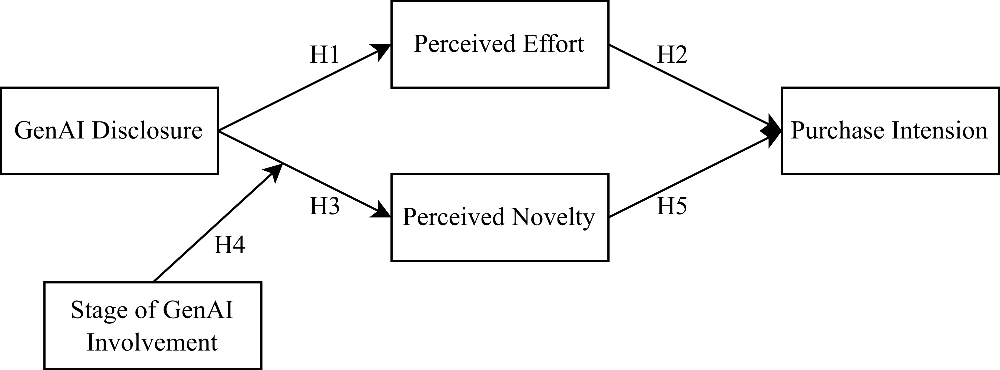

# Not All GenAI Disclosures Are Alike

## How the Stage of GenAI Involvement Shapes Purchase Intention for Digital Games

**ICEB 2026 · Beijing, China**

<!--
Presenter notes: (30 seconds)
Good morning everyone. My name is Fangzhan Lin, and today I will present our study, "Not All GenAI Disclosures Are Alike." The paper examines how disclosure of generative AI involvement shapes players' purchase intention for digital games. The key idea is that disclosure is not just a simple warning label. In games, it can also signal new forms of interaction and novelty, depending on how the involvement of GenAI is described.
-->
---
layout: default
class: narrative-slide
---

# INTRODUCTION

<h3>GenAI use is becoming visible</h3>

Players increasingly encounter explicit statements that a game uses GenAI in product descriptions, development notes, or platform labels.

<h3>Disclosure can hurt valuation</h3>

Prior work on AI-generated products suggests that disclosure can weaken source-related beliefs tied to human creation.

<h3>Games complicate the prediction</h3>

Games are interactive hedonic systems, so players evaluate not only how a game was made, but also what it may do during play.

The key issue is whether GenAI disclosure is interpreted as a production cue, an experiential cue, or both.

<!--
Presenter notes: (45 seconds)
Let me start with the motivation. GenAI use is becoming increasingly visible in digital games, for example in product descriptions, developer notes, or platform labels. Prior research on AI-generated products often suggests a negative reaction: when people know that AI is involved, they may infer less human labor, less craft, and lower authenticity. But games complicate this prediction. A game is not only a finished creative product; it is also an interactive hedonic system. Players care about how the game was made, but also about what the game can do during play. So the same disclosure may work as both a production cue and an experiential cue.
-->
---
layout: statement
---

# Research Question

**How does GenAI disclosure influence players' purchase intention for digital games, and through what mechanisms does this effect emerge?**

<!--
Presenter notes: (30 seconds)
This leads to our research question: how does GenAI disclosure influence players' purchase intention for digital games, and through what mechanisms does this effect emerge? We focus on two belief-based mechanisms. One is perceived effort, which captures the human labor and craft that players attribute to the game. The other is perceived novelty, which captures whether the game seems fresh, technologically distinctive, and potentially different from existing games.
-->
---
layout: default
class: tension-slide
---

# CONCEPTUAL BACKGROUND

Source-related inference
<h3>AI disclosure may reduce perceived human effort</h3>

Creative products are often valued partly because they are believed to embody human labor, intentionality, and craft.

Experience-related inference
<h3>AI disclosure may increase perceived novelty</h3>

In games, GenAI can also signal adaptive dialogue, event variation, and responsive world behavior during play.

This tension motivates a dual-pathway framework rather than a one-directional disclosure effect.

<!--
Presenter notes: (60 seconds)
The conceptual background is built around a tension. On the one hand, AI disclosure can reduce source-related value. For many creative products, people value the object partly because they believe it contains human effort, intention, and craft. If GenAI is disclosed, that belief may be weakened. On the other hand, games are experience-oriented and interactive. In this context, GenAI may also signal adaptive dialogue, dynamic events, or responsive world behavior. That can make the game seem more novel. So instead of assuming one overall negative disclosure effect, we propose a dual-pathway framework: a negative pathway through lower perceived effort and a positive pathway through higher perceived novelty.
-->
---
layout: default
class: stage-slide
---

# Stage of GenAI Involvement

CONCEPTUAL BACKGROUND

<h3>Pre-interaction involvement</h3>

GenAI is described as helping create dialogue, story events, and world content before play.

<strong>Likely interpretation:</strong>
A backstage production aid.

<h3>During-interaction involvement</h3>

GenAI is described as generating dialogue, in-game events, and world content in real time during gameplay.

<strong>Likely interpretation:</strong>
An in-play interaction capability.

<!--
Presenter notes: (55 seconds)
The next key distinction is the stage of GenAI involvement. We distinguish pre-interaction involvement from during-interaction involvement. In the pre-interaction condition, GenAI is described as helping create content before play starts, such as dialogue, story events, and world content. This sounds more like a backstage production aid. In the during-interaction condition, GenAI is described as generating content in real time during gameplay. This sounds more like an in-play interaction capability. Our argument is that this distinction should matter especially for novelty. During-interaction involvement is more likely to make players imagine a dynamic and responsive experience.
-->
---
layout: default
class: model-slide
---

# THEORETICAL FRAMEWORK AND HYPOTHESES

<figure class="model-figure model-figure-wide">
  
  <figcaption>Figure 1. Research model.</figcaption>
</figure>

<!--
Presenter notes: (55 seconds)
This figure summarizes the research model. GenAI disclosure affects two perceptions. First, it can lower perceived effort. Second, it can increase perceived novelty. The stage of GenAI involvement moderates the disclosure-to-novelty path, because novelty should be more strongly activated when GenAI is framed as part of gameplay rather than only part of production. Both perceived effort and perceived novelty then feed into purchase intention. So the model is not saying that disclosure is simply good or bad. It asks which inference becomes more salient.
-->
---
layout: default
class: pathway-slide
---

# Hypotheses in One Sentence

GenAI disclosure<b>H1</b>lower perceived effort<b>H2</b>purchase intention

GenAI disclosure<b>H3</b>higher perceived novelty<b>H5</b>purchase intention

<strong>H4</strong>During-interaction involvement strengthens the novelty route.

<!--
Presenter notes: (50 seconds)
The hypotheses follow directly from this model. H1 predicts that GenAI disclosure lowers perceived effort. H2 predicts that perceived effort increases purchase intention. H3 predicts that GenAI disclosure increases perceived novelty. H5 predicts that perceived novelty increases purchase intention. H4 is the boundary condition: during-interaction involvement should strengthen the novelty route. I separate H4 here because it is not simply between H3 and H5. It specifically concerns when the novelty mechanism becomes stronger.
-->
---
layout: default
class: method-slide
---

# RESEARCH METHOD

<strong>Design</strong>Scenario-based online experiment in digital games.

<strong>Conditions</strong>No disclosure, pre-interaction disclosure, during-interaction disclosure.

<strong>Sample</strong>399 valid responses; 133 participants per condition.

<strong>3</strong> conditions
<strong>399</strong> responses
<strong>133</strong> per cell
<strong>5,000</strong> bootstrap resamples

<!--
Presenter notes: (45 seconds)
To test the model, we conducted a scenario-based online experiment in the context of digital games. The design had three conditions: no disclosure, pre-interaction disclosure, and during-interaction disclosure. We collected 399 valid responses, with 133 participants in each condition. In the analysis, we used mean comparisons, regression models with controls, and bootstrap mediation with 5,000 resamples. This design allows us to isolate the wording of the GenAI disclosure while keeping the focal product constant.
-->
---
layout: default
class: method-slide
---

# Stimulus and Procedure

01<strong>Scenario</strong>
Participants imagined browsing a digital game platform.

02<strong>Product page</strong>
They viewed a premium narrative role-playing game.

03<strong>Disclosure</strong>
The GenAI statement varied across three conditions.

Held constant
<strong>Title, genre, price, screenshots, and product description.</strong>

Manipulated
<strong>No disclosure, pre-interaction involvement, or during-interaction involvement.</strong>

The manipulation changes the disclosed stage of GenAI contribution, not the timing of disclosure presentation.

<!--
Presenter notes: (55 seconds)
The procedure was straightforward. Participants imagined browsing a digital game platform. They then viewed a product page for a premium narrative role-playing game. Across conditions, the title, genre, price, screenshots, and product description were held constant. What changed was only the GenAI disclosure statement. In one condition, there was no AI statement. In the pre-interaction condition, GenAI was described as helping before gameplay. In the during-interaction condition, GenAI was described as contributing during gameplay. Importantly, this manipulation changes the disclosed stage of contribution, not the timing of disclosure presentation.
-->
---
layout: default
class: method-slide
---

# Measures and Checks

<strong>Perceived effort</strong>Substantial human effort invested in creating the game.

<strong>Perceived novelty</strong>The game is seen as new, fresh, and exciting.

<strong>Purchase intention</strong>Willingness to buy the focal digital game.

<strong>Willingness to pay</strong>Maximum amount in CNY participants were willing to pay.

Reliability<strong>effort = .941 · novelty = .816 · purchase intention = .929</strong>

Controls<strong>openness to technology · genre preference · AI familiarity</strong>

Checks<strong>perceived AI use · disclosed stage of involvement</strong>

<!--
Presenter notes: (45 seconds)
We measured four main outcomes and beliefs. Perceived effort captures whether participants thought substantial human effort was invested in the game. Perceived novelty captures whether the game seemed new, fresh, and exciting. Purchase intention is the main behavioral intention outcome, and willingness to pay is included as a supplementary monetary outcome. The key scales showed satisfactory reliability, especially effort, novelty, and purchase intention. We also included controls such as openness to technology, genre preference, and AI familiarity, and we checked both perceived AI use and perceived stage of involvement.
-->
---
layout: default
class: results-slide
---

# RESULTS: Manipulation Checks

Disclosure salience
<h3>Disclosure salience</h3>

Participants in disclosure conditions reported substantially higher perceived AI use than no-disclosure participants.

<strong>F(2, 396) = 339.58, p &lt; .001</strong>

Stage differentiation
<h3>Stage differentiation</h3>

Participants distinguished whether GenAI was described as being used before play or during gameplay.

<strong>Manipulations were successful.</strong>

The experiment therefore successfully separated disclosure presence from the disclosed stage of GenAI involvement.

<!--
Presenter notes: (40 seconds)
Before testing the hypotheses, we first checked whether the manipulation worked. The results were clear. Participants in the disclosure conditions perceived significantly more AI use than those in the no-disclosure condition, with F equal to 339.58 and p below .001. They also distinguished whether GenAI was described as being used before play or during gameplay. This is important because our theory depends on separating disclosure presence from the disclosed stage of involvement. The checks support that separation.
-->
---
layout: default
class: results-slide
---

# RESULTS: The Effort Pathway

H1, H2: source-related negative mechanism

H1
<h3>Disclosure lowered perceived effort</h3>

Perceived effort was significantly lower in the disclosure conditions than in the no-disclosure condition.

<strong>Welch's t(264.6) = -6.18, p &lt; .001, d = -0.60</strong>

H2
<h3>Effort still mattered for purchase intention</h3>

Perceived effort positively predicted purchase intention, although the indirect effect through effort was marginal.

<strong>r = .216, p &lt; .001; indirect p = .053</strong>

<!--
Presenter notes: (55 seconds)
Now I turn to the effort pathway, corresponding to H1 and H2. H1 was supported: GenAI disclosure lowered perceived effort compared with no disclosure. The effect was statistically significant, with Welch's t equal to -6.18 and p below .001. H2 was also supported: perceived effort positively predicted purchase intention. However, the indirect effect through effort was only marginal, with p equal to .053. So the negative source-related mechanism exists, but in this setting it is not the strongest pathway to purchase intention.
-->
---
layout: default
class: results-slide
---

# RESULTS: The Novelty Pathway

H3, H5: positive mechanism

H3
<h3>Disclosure increased perceived novelty</h3>

GenAI disclosure made the focal game appear more technologically distinctive relative to no disclosure.

<strong>Welch's t(251.0) = 2.88, p = .004, d = 0.32</strong>

H5
<h3>Novelty strongly predicted purchase intention</h3>

Perceived novelty showed a much stronger link to purchase intention than perceived effort.

<strong>r = .554, p &lt; .001; beta = 0.409, p &lt; .001</strong>

<!--
Presenter notes: (55 seconds)
The novelty pathway tells the other side of the story. H3 was supported: GenAI disclosure increased perceived novelty relative to no disclosure. The effect was significant, with Welch's t equal to 2.88 and p equal to .004. H5 was also strongly supported: perceived novelty had a much stronger relationship with purchase intention than perceived effort, with r equal to .554 and regression beta equal to .409. This suggests that in digital games, GenAI disclosure can activate a positive technology-based inference, not only a negative production-based inference.
-->
---
layout: default
class: results-slide
---

# RESULTS: Stage-Contingent Novelty

H4: the positive pathway depends on the disclosed stage of involvement

During-interaction
<h3>During-interaction disclosure produced higher novelty</h3>

Novelty was significantly higher when GenAI was framed as contributing during gameplay rather than before gameplay.

<strong>Welch's t(263.8) = 2.68, p = .008, d = 0.33</strong>

Moderated mediation
<h3>The indirect novelty path emerged mainly during gameplay</h3>

The positive indirect effect through novelty was significant for during-interaction disclosure, but not for pre-interaction disclosure.

<strong>Index = 0.100, 95% CI [0.017, 0.197]</strong>

<!--
Presenter notes: (65 seconds)
The next result is central to the paper. H4 asks whether the novelty pathway depends on the stage of GenAI involvement. The answer is yes. Novelty was significantly higher when GenAI was framed as contributing during gameplay rather than before gameplay. The Welch's t value was 2.68, with p equal to .008. The moderated mediation result points in the same direction: the indirect effect through novelty was significant mainly for the during-interaction disclosure condition, and the index of moderated mediation was positive with a confidence interval excluding zero. So the positive effect of disclosure is not automatic. It becomes stronger when disclosure helps players imagine a novel gameplay experience.
-->
---
layout: default
class: results-slide
---

# Supplementary Outcome: Willingness to Pay

Direct effect

No significant condition-level differences in willingness to pay were observed.

Distribution

WTP was highly skewed, with a median of CNY 68 in all three conditions.

Mechanisms

The effort path was significantly negative; the novelty path was positive but not significant.

The purchase-intention results provide the clearer test of the proposed dual-pathway framework.

<!--
Presenter notes: (40 seconds)
We also examined willingness to pay as a supplementary outcome. Here the pattern is weaker. We did not find significant condition-level differences in willingness to pay, and the distribution was highly skewed. The median willingness to pay was CNY 68 in all three conditions. At the mechanism level, the effort path was significantly negative, while the novelty path was positive but not significant. So for this study, purchase intention provides the clearer test of the proposed dual-pathway framework.
-->
---
layout: default
class: discussion-slide
---

# DISCUSSION

<strong>1</strong>GenAI disclosure is not a uniform negative cue.

<strong>2</strong>It simultaneously weakens perceived human effort and strengthens perceived novelty.

<strong>3</strong>The positive novelty route is strongest when GenAI is framed as part of gameplay.

<!--
Presenter notes: (55 seconds)
The overall message is that GenAI disclosure is not a uniform negative cue. It does reduce perceived human effort, which can hurt purchase intention. But it also increases perceived novelty, which can improve purchase intention. More importantly, the positive route is strongest when GenAI is framed as part of gameplay. This helps explain why consumers may react differently to different GenAI disclosures. They are not only responding to the presence of AI. They are also interpreting what kind of role AI is expected to play.
-->
---
layout: default
class: contribution-slide
---

# Theoretical Contributions

<strong>Disclosure research</strong>
Extends GenAI disclosure research from relatively static creative products to interactive hedonic systems.

<strong>Concept refinement</strong>
Distinguishes the presence of disclosure from the stage of GenAI involvement described by that disclosure.

<strong>Mechanism</strong>
Identifies perceived novelty as a positive pathway that can coexist with effort-based discounting.

<!--
Presenter notes: (55 seconds)
The paper makes three theoretical contributions. First, it extends GenAI disclosure research from relatively static creative products to interactive hedonic systems. Second, it refines the concept of disclosure by distinguishing the presence of disclosure from the stage of GenAI involvement described in that disclosure. Third, it identifies perceived novelty as a positive mechanism that can coexist with effort-based discounting. This dual-pathway view gives us a more balanced understanding of GenAI disclosure in digital games.
-->
---
layout: default
class: practical-slide
---

# Practical Implications

Avoid<strong>Do not treat all GenAI disclosures as equivalent.</strong>

Clarify<strong>Explain whether GenAI contributes to production or to gameplay experience.</strong>

Emphasize<strong>When appropriate, foreground in-play value rather than only backstage automation.</strong>

Disclosure wording is a design lever: it can either highlight reduced human input or activate expectations of a novel play experience.

<!--
Presenter notes: (50 seconds)
The practical implication is that firms should not treat all GenAI disclosures as equivalent. Disclosure wording matters. If GenAI is described only as backstage automation, players may focus on reduced human input. But if GenAI is accurately described as supporting in-play value, such as dynamic dialogue or responsive events, it may activate expectations of novelty. The point is not to exaggerate AI capabilities. Rather, the point is to make the role of GenAI clear so that players can form the right expectation about the product experience.
-->
---
layout: default
class: limitation-slide
---

# Limitations and Future Research

Beliefs<strong>Other perceptions remain open.</strong>
Future work can examine perceived quality, authenticity, and realism.

Scope<strong>Single genre and product-page scenario.</strong>
Future studies can test other game genres and disclosure contexts.

Moderators<strong>Individual differences may matter.</strong>
AI attitudes and innovation orientation may further condition reactions.

Together, these extensions would test the boundary conditions of the dual-pathway account.

<!--
Presenter notes: (45 seconds)
There are also several limitations. First, the study focuses on the stage of disclosed GenAI involvement and does not examine other potentially important perceptions, such as quality, authenticity, or realism. Second, the experiment uses a single game genre and a single product-page scenario, which may limit generalizability. Third, although we included several controls, future research could examine whether individual differences in AI attitudes or innovation orientation further condition the observed effects.
-->
---
layout: statement
---

# Thank You

**Questions and comments are welcome.**

<!--
Presenter notes: (10 seconds)
Thank you very much for listening. I look forward to your questions and comments.
-->
---
layout: default
class: references-slide
---

# REFERENCES

Ashby, T., Webb, B. K., Knapp, G., Searle, J., & Fulda, N. (2023). Personalized quest and dialogue generation in role-playing games. <em>CHI Conference on Human Factors in Computing Systems</em>, 1-20.

Fuchs, C., Schreier, M., & van Osselaer, S. M. J. (2015). The handmade effect. <em>Journal of Marketing</em>, 79(2), 98-110.

Gallotta, R., Todd, G., Zammit, M., Earle, S., Liapis, A., Togelius, J., & Yannakakis, G. N. (2024). Large language models and games. <em>IEEE Transactions on Games</em>, 1-18.

Gu, L., & Li, Y. (2022). Who made the paintings: Artists or artificial intelligence? <em>Frontiers in Psychology</em>, 13.

Hamari, J., & Keronen, L. (2017). Why do people play games? <em>International Journal of Information Management</em>, 37(3), 125-141.

Hsu, C.-L., & Lu, H.-P. (2004). Why do people play on-line games? <em>Information & Management</em>, 41(7), 853-868.

Hussain, A., Hollebeek, L. D., Marder, B., & Ting, D. H. (2025). In-game content purchase motivations. <em>Information & Management</em>, 62(7), 104207.

Kreuzbauer, R., King, D., & Basu, S. (2015). The mind in the object. <em>Journal of Experimental Psychology: General</em>, 144(4), 764-787.

<!--
Presenter notes: (backup slide)
This is a backup reference slide. I would not present it during the 15-minute talk unless someone asks about the literature base. If needed, I can say: "These are the main references supporting the disclosure, hedonic technology, and game-related arguments."
-->
---
layout: default
class: references-slide
---

# REFERENCES

Lin, C.-P., & Bhattacherjee, A. (2010). Extending technology usage models to interactive hedonic technologies. <em>Information Systems Journal</em>, 20(2), 163-181.

Magni, F., Park, J., & Chao, M. M. (2024). Humans as creativity gatekeepers. <em>Journal of Business and Psychology</em>, 39(3), 643-656.

Newman, G. E., & Bloom, P. (2012). Art and authenticity. <em>Journal of Experimental Psychology: General</em>, 141(3), 558-569.

Rix, J., Berger, B., Hess, T., & Rzepka, C. (2025). The algorithm discount. <em>Journal of Management Information Systems</em>, 42(2), 633-668.

Sikhondze, B., Ye, H. J., Wang, W., Zhan, X., & Santhanam, R. (2025). Are you willing to pay for GenAI products? <em>Journal of Management Information Systems</em>, 42(2), 431-456.

van der Heijden, H. (2004). User acceptance of hedonic information systems. <em>MIS Quarterly</em>, 28(4), 695-704.

Wang, L., Sun, Y., & Luo, X. (Robert). (2022). Game affordance, gamer orientation, and in-game purchases. <em>Information Systems Journal</em>, 32(6), 1097-1125.

Wu, J., & Holsapple, C. W. (2014). Imaginal and emotional experiences in pleasure-oriented IT usage. <em>Information & Management</em>, 51(1), 80-92.

<!--
Presenter notes: (backup slide)
This is the second backup reference slide. Again, I would not spend formal presentation time on it. It is mainly there to document the theoretical foundations and allow the audience to follow up after the talk.
-->
